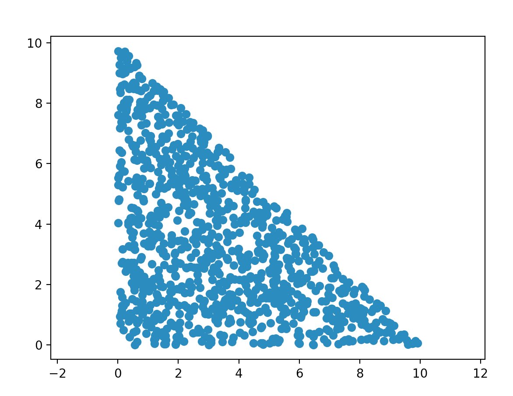

The optimization of electrical machines is a promising area in engineering (from electric traction to renewable energy conversion), where weight reduction, as well as performance improvement in both torque and efficiency are the major concerns.

Some studies had reported the success of increment in the performance of motors by using magnetic field analysis and optimization methods. 
>There are many papers concerning this technique. 
The dipole magnet is optimized by putting dipole conductors [5]. 
A simple magnetic device was designed by optimizing the material distribution [6]. 
The sensitivity analysis is applied to the material updating in source distribution optimization [7]. 
But these analyses are limited to simple models and did not mention to the application of motor. 
The genetic algorithm (GA) is applied to the optimization of pole shape of motor [8], but it is difficult to increase the number of elements in the design domain, because a stochastic method like GA is used. 
The density method is also applied to a simple C core model [9], [10]. 
The immune algorithm and multigrid method are also applied to the optimization of a simple magnetic head model [11]. But, these are mainly theoretical. 
A shape design sensitivity analysis is applied to the optimization of HTS (high temperature superconducting) motor [12], but the rotation of rotor is not considered. 
The density method is applied to the optimization of an actual motor, but the analysis is not sufficient, because the nonlinearity of magnetic material is not taken into account [13]. 
Namely, the sensitivity analysis using the adjoint variable method proposed in [14] is widely used in the optimization [7], [10], [12], [13]. 
>

In those analyses, the outline of the optimized shape is given in advance, then specified parameters are determined by using a parametric analysis or conventional optimization method. 
If an optimization method using a system which turns materials into different number of shapes in a design domain, is used, there is a possibility that a new magnetic circuit is discovered, because it is not necessary to set design variables in advance.

As a result, reports on the optimization of electric machines taking account of the rotation of rotor and topologies of magnetic material are few. In addition, the edge of different materials is rough when using ON/OFF method optimization in most of cases, which is difficult to produce the prototype directly. Further design and test are needed after optimization.

In this project, a special emphasis will be put on the topology of magnetic materials and rotor of an Interior Permanent Magnet (IPM) machine. IPM machine is one kind of permanent magnet synchronous motor, the topology of magnetic materials is a significant part that influences the performance of motor. 

In electric machine design process, most of the requirements for electrical machine design are in contradiction to each other (reduction in volume or mass, increase in efficiency etc.). 
Therefore finding a design that will satisfy all of them can be an overwhelming task due to a large number of parameters whose effects on the motor performance and quality of the design are strongly coupled. 
There is an obvious need for a systematic approach to decision making based on an iterative scheme that would gradually lead to an optimal motor design which satisfies all the constraints imposed upon it and still fulfills its main task to produce torque. 
The design of a machine can be described by a vector ~x of D variables stating dimensions, non-dimensional parameters, current densities, types of materials used etc. 
The design is subject to a set of m constraints which may include specifications arising from international technical standards and electromagnetic, thermal, mechanical or manufacturing constraints. 
The goal of the design optimization is to make a chosen objective function f(~x) reach its minimum or maximum value while keeping other technical indices within acceptable ranges [1].

Definition of Electric machine design problem:
Electric machine design problem P = (S, f) can be defined by:
1.	A set of variables X = {x1, …, xn} where x1 to xn are different vectors containing a set of points that forms a polygon in design space. The size of variables is “n”.
2.	Variable domains D1, …, Dn where each D is a 2 times N matrix represents the size and range of variables defined above.
3.	Constraints among variables including rules like “each variable vector represented polygon should not intersect”, “The size of magnets should less than a fixed value” etc.
4.	A set of objective function to be minimized, where 
f(~x) = [f1(~x), f2(~x), . . . , fk(~x)]

The set of all possible feasible assignments is 
S = {s = {(x1, v1), ... , (xn, vn)} | vi ∈ Di, s satisfies all the constraints}. 
S is usually called a search (or solution) space, as each element of the set can be seen as a candidate solution. To solve a combinatorial optimization problem one has to find a solution s∗ ∈ S with minimum objective function value, that is, f (s∗) ≤ f (s) ∀s ∈ S. s∗ is called a globally optimal solution of (S, f ) and the set S∗ ⊆ S is called the set of globally optimal solutions.

Complete algorithms are guaranteed to find for every finite size instance of a CO problem an optimal solution in bounded time (see Papadimitriou and Steiglitz [1982] and Nemhauser and Wolsey [1988]). Yet, for CO problems that are NP-hard [Garey and Johnson 1979], no polynomial time algorithm exists, assuming that P̸=NP. Therefore, complete methods might need exponential computation time in the worst-case. This often leads to computa- tion times too high for practical purposes. Thus, the use of approximate methods to solve CO problems has received more and more attention in the last 30 years. In ap- proximate methods we sacrifice the guar- antee of finding optimal solutions for the sake of getting good solutions in a signifi- cantly reduced amount of time. 

Determining the topology of rotor and magnetic material is a compromise between practical and theoretical design, and searching for a “finest” configuration of a set of variables to achieve some objectives is a computational complex work. Traditionally, the design works are divide into two classes: those where solutions are encoded with real-valued variables, and those where solutions are encoded with discrete variables. [1] The latter one this a typical class of problem called Combinatorial Optimization (CO) problems. Regarding Papadimitriou and Steiglitz [2], in CO problems, we are looking for an object from a finite—or possibly countably infinite—set. 
Therefore, electric machine design can be considered as one kind of combinatorial optimization problem from the definition. 
A lot of modeling language can be described the CO problem, including an integer number, a subset, a permutation, or a graph.

generate point set in a triangle area

[1]()

[2]()

[3]()

[4]()

[5]()

[6]()

[7]()

[8]()